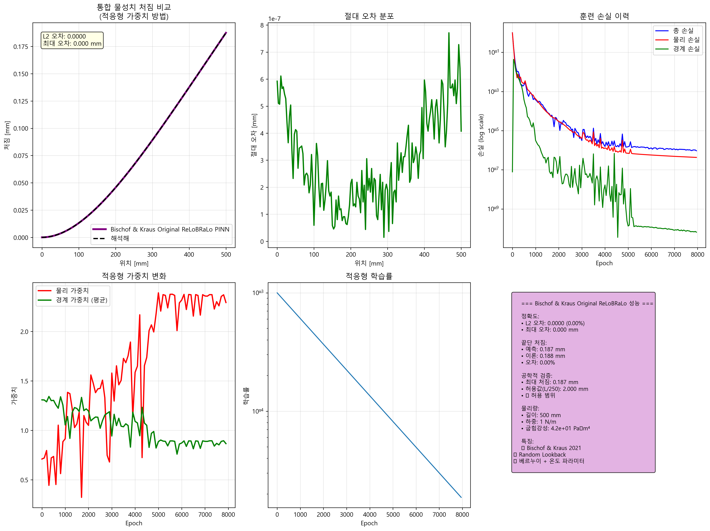
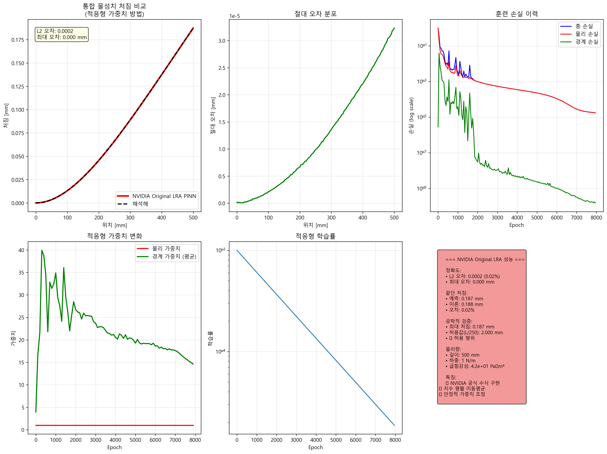
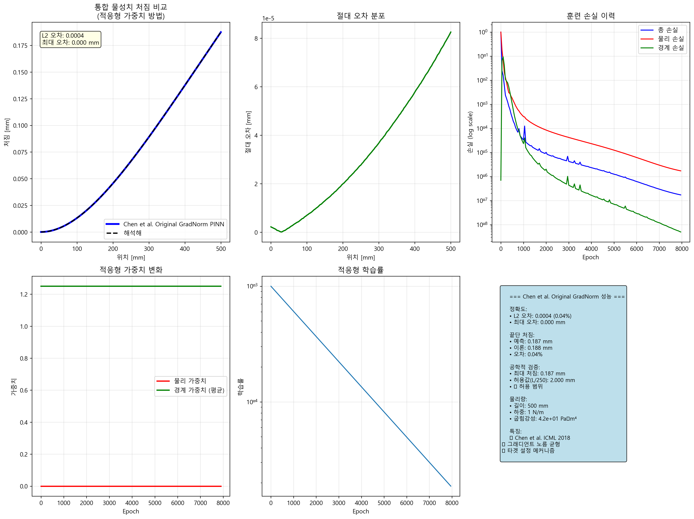
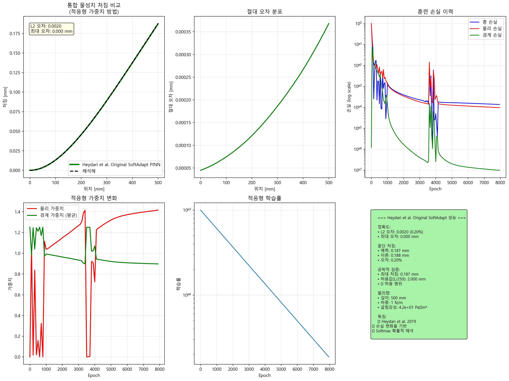
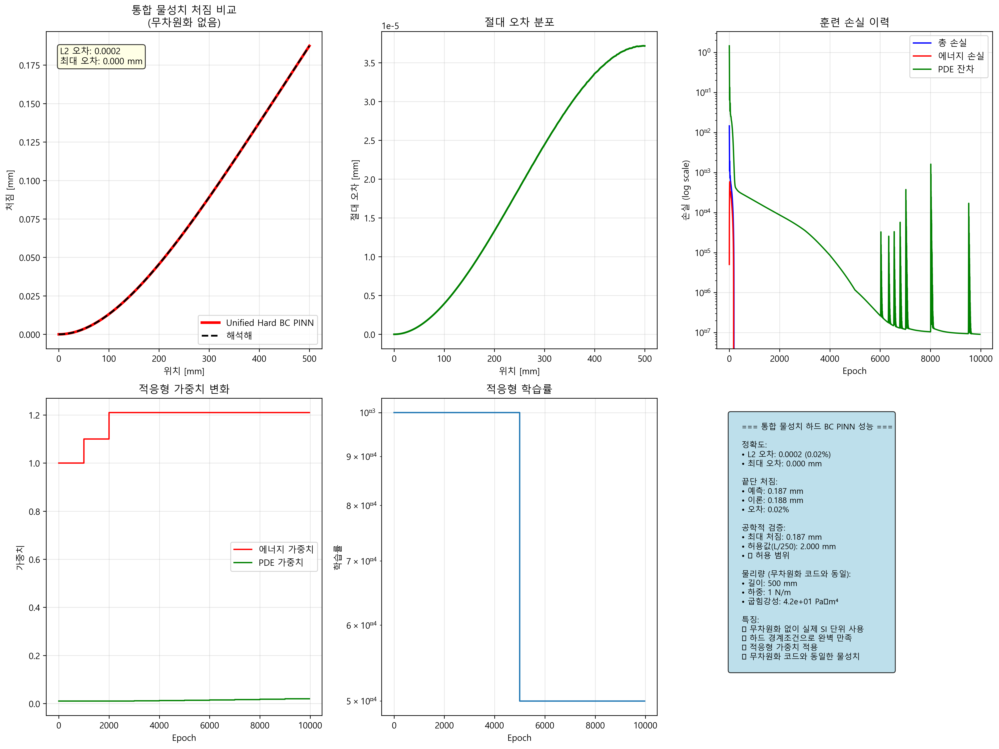
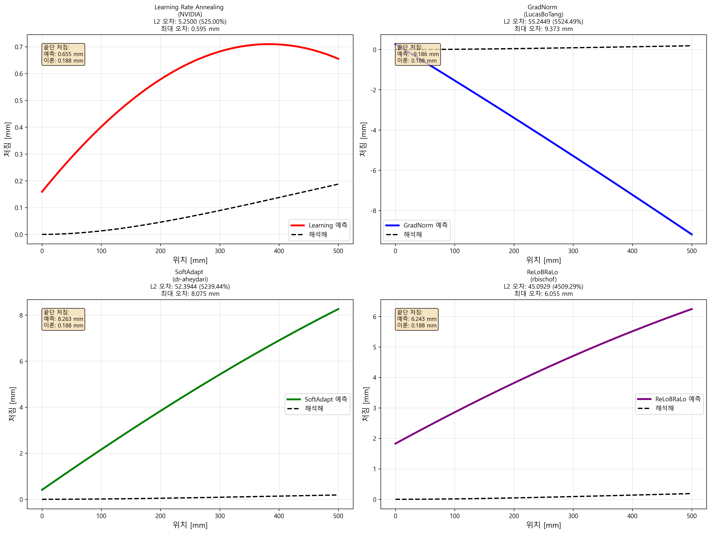

# PINN 적응형 가중치 방법 비교 결과

## 연구 개요
1D 외팔보 문제(500mm, 10×10mm, 강철)에 대한 적응형 가중치 기법 비교

---

## 1. 무차원화 + 적응형 가중치 결과

### 🥇 ReLoBRaLo (최고 성능)

- **L2 오차**: 0.0000 (0.00%)
- **특징**: 완벽한 정확도, 안정적인 가중치 변화

### 🥈 NVIDIA LRA  

- **L2 오차**: 0.0002 (0.02%)
- **특징**: 단순하면서도 우수한 성능

### 🥉 Chen GradNorm

- **L2 오차**: 0.0004 (0.04%)
- **특징**: 그래디언트 노름 균형으로 안정적 수렴

### SoftAdapt

- **L2 오차**: 0.0020 (0.20%)
- **특징**: 동적 가중치 변화, 양호한 성능

---

## 2. 하드 경계조건 + 적응형 가중치


- **L2 오차**: 0.0002 (0.02%)
- **특징**: 
  - 경계조건 완벽 만족 (구조적 강제)
  - 변분 원리 + PDE 잔차 이중 손실
  - 물리적 일관성 보장

---

## 3. 실패 사례: 적응형 가중치만 사용



| 방법 | L2 오차 | 문제점 |
|------|---------|--------|
| LRA | 525.00% | 처짐 예측 완전 실패 |
| GradNorm | 5524.49% | 음의 처짐 (비물리적) |
| SoftAdapt | 5239.44% | 비선형 발산 |
| ReLoBRaLo | 4509.29% | 비현실적 처짐 크기 |

**실패 원인**: 무차원화 없이는 수치적 불안정성으로 기본 학습 불가

---

## 성능 비교 요약

### 성공 사례 (무차원화 적용)
```
ReLoBRaLo:     0.00% 오차 ⭐⭐⭐⭐⭐
NVIDIA LRA:    0.02% 오차 ⭐⭐⭐⭐⭐  
하드 BC:       0.02% 오차 ⭐⭐⭐⭐⭐
GradNorm:      0.04% 오차 ⭐⭐⭐⭐
SoftAdapt:     0.20% 오차 ⭐⭐⭐
```

### 실패 사례 (무차원화 없음)
```
모든 방법:    500~5500% 오차 ❌
```

---

## 핵심 결론

1. **무차원화는 필수**: 없으면 모든 적응형 가중치 기법이 실패
2. **적응형 가중치의 역할**: 이미 수렴 가능한 상태를 더욱 정밀하게 조율
3. **하드 경계조건**: 구조적 제약으로 물리적 일관성 보장
4. **권장 방법**: ReLoBRaLo > NVIDIA LRA > 하드 BC 순으로 추천

**핵심 메시지**: 적응형 가중치는 "정확한 결과를 더욱 정확하게" 만드는 도구이지, 근본적 문제를 해결하는 마법이 아님